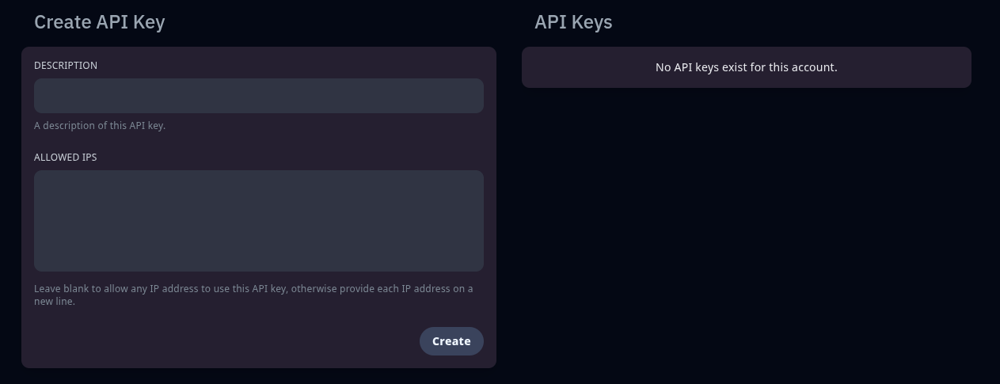

## 🛠️ API

L’onglet **API** vous permet de générer des **clés d’API personnelles** pour interagir avec le panel de manière automatisée.
Ces clés sont utiles pour les développeurs ou les utilisateurs avancés souhaitant créer des intégrations externes (bots Discord, scripts, etc.).

### 🔑 Créer une clé d’API

Pour générer une nouvelle clé :

1. Cliquez sur **“Create API Key”**
2. Donnez un **nom** à la clé (ex. : `bot-discord`, `scripts`)
3. Cliquez sur **Create**
   → Une clé vous sera affichée **une seule fois**. Copiez-la et conservez-la en lieu sûr.

### 📋 Gérer les clés existantes

Une fois créées, vous pouvez :

* Voir la **date de création**
* **Révoquer** une clé à tout moment en cliquant sur l’icône poubelle

> ⚠️ Les clés d’API donnent un **accès direct** à votre compte et à ses permissions : **ne les partagez jamais** et révoquez-les immédiatement en cas de doute.

---

💡 **Cas d’usage courant** :

* Afficher l’état du serveur dans un bot Discord
* Exécuter des commandes via un script externe
* Automatiser des redémarrages, sauvegardes ou notifications

---

🔍 **Aperçu de l’onglet API** :

---