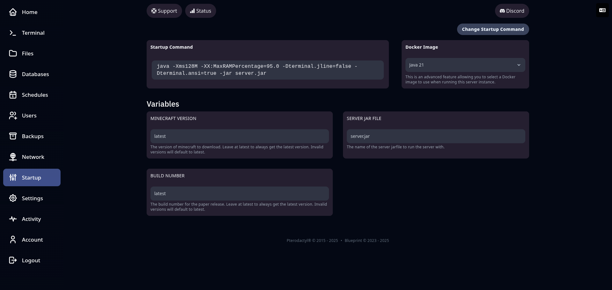

## ⚙️ Démarrage (Startup)

L’onglet **Startup** permet de gérer les **paramètres de lancement du serveur**. C’est ici que vous pouvez modifier la **commande de démarrage**, choisir l’**image Docker**, et définir des **variables personnalisées** (comme la version de Minecraft ou le fichier `.jar` à exécuter).

Depuis cette interface, vous pouvez :

* 🔧 **Modifier la commande de démarrage** utilisée pour lancer le serveur
* 🐳 **Choisir l’image Docker** (ex. Java 17, Java 21) adaptée à votre version de jeu ou modpack
* 🧩 Configurer des **variables dynamiques** comme :

  * `MINECRAFT VERSION` : la version à installer (ex : `1.20.4`, ou `latest`)
  * `BUILD NUMBER` : version spécifique pour PaperMC ou autre wrapper
  * `SERVER JAR FILE` : nom du fichier `.jar` à lancer (par défaut : `server.jar`)

💡 Ces variables sont intégrées automatiquement dans la commande de démarrage.

---

⚠️ **Attention** :

> Modifier ces valeurs sans connaître leur effet peut empêcher le serveur de démarrer correctement.
> En cas de doute, contactez le support ou consultez la documentation du type de serveur utilisé.

---

🖥️ **Aperçu de l’onglet Startup** :

---