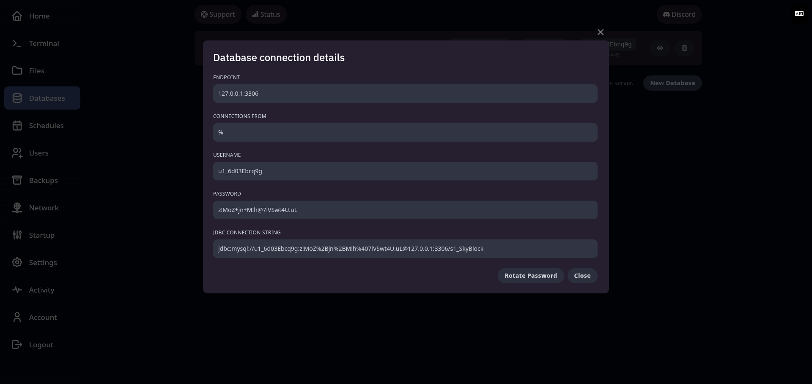

## 🗄️ Gestionnaire de base de données

Le panel Pterodactyl intègre un outil simple pour gérer vos **bases de données MySQL**, idéal pour les serveurs nécessitant une base de données (plugins, sites web, etc.).

Depuis l’onglet **Bases de données**, vous pouvez :

* **Créer une nouvelle base de données** en quelques clics
* Obtenir les **informations de connexion** (nom d’hôte, port, utilisateur, etc.)
* **Modifier le mot de passe** de la base à tout moment
* **Supprimer** une base de données inutilisée

💡 Une fois la base créée, vous pouvez y accéder via un outil externe comme DBeaver ou tout autre gestionnaire MySQL, en utilisant les identifiants fournis.

---

🧬 **Aperçu de la gestion des bases de données** :

---