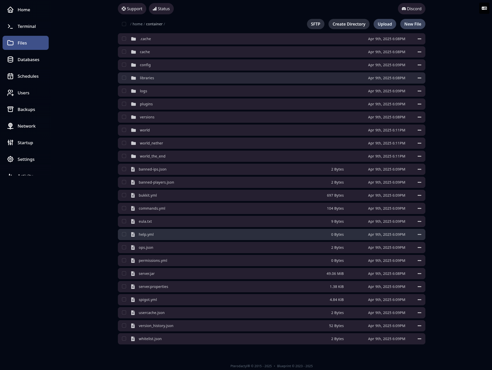

## 📁 Gestionnaire de fichiers

Le **gestionnaire de fichiers** du panel vous permet d’explorer, modifier et organiser les fichiers de votre serveur directement depuis l’interface web, sans avoir besoin de logiciel FTP.

Depuis cet onglet, vous pouvez :

* Naviguer dans les dossiers de votre serveur
* **Téléverser** des fichiers (glisser-déposer possible)
* **Créer**, **renommer**, **supprimer** des fichiers ou dossiers
* **Modifier le contenu** des fichiers texte (comme `server.properties`, `config.yml`, etc.)
* **Décompresser/compresser** des archives `.zip`

C’est un outil essentiel pour effectuer rapidement des ajustements sans quitter votre navigateur.

---

🗂️ **Vue du gestionnaire de fichiers** :

---