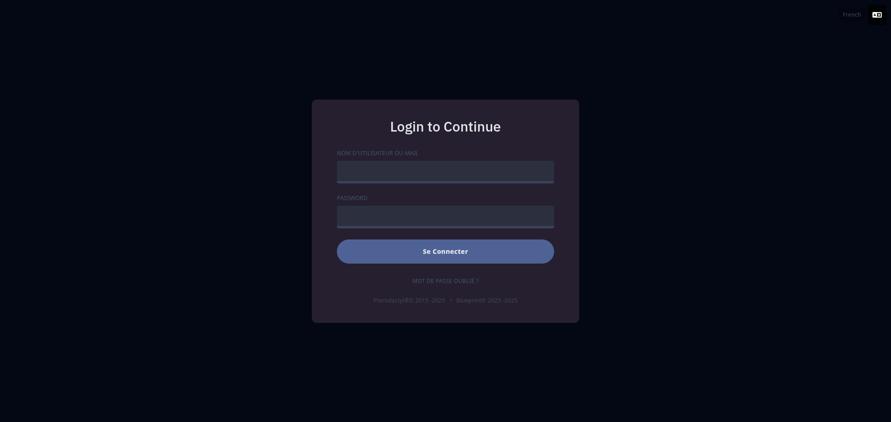
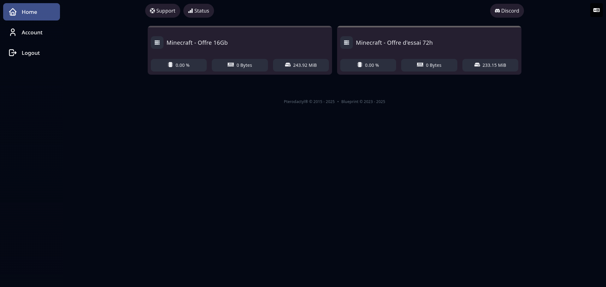
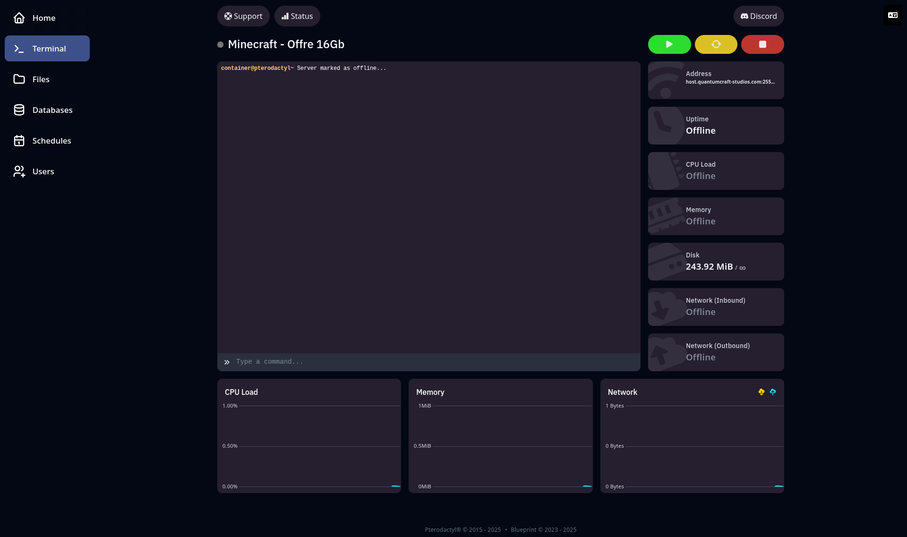

# 🚀 Démarrer avec votre serveur QuantumCraft Studios

Bienvenue chez **QuantumCraft Studios** et félicitations pour votre tout nouveau serveur !  
Nous utilisons le panel [**Pterodactyl**](https://pterodactyl.io) pour vous offrir une interface simple, performante et intuitive pour gérer vos services.

Ce guide a pour but de vous accompagner dans la **prise en main** de votre serveur et vous aider à vous familiariser rapidement avec les outils mis à votre disposition.

---

## 🛒 Commander un serveur

Vous n'avez pas encore de serveur ?  
Découvrez nos offres disponibles en ligne, incluant **Minecraft**, **PalWorld**, **Vintage Story** et bien d'autres jeux à venir.

👉 [Consulter nos offres](https://quantumcraft-studios.com/nos-offres.php)

---

## 🔐 Connexion au panel

Une fois votre commande validée, vous recevrez par e-mail vos identifiants de connexion.  
Accédez ensuite à votre espace d’administration via le lien suivant :

👉 [https://host.quantumcraft-studios.com](https://host.quantumcraft-studios.com)

---

# 🧭 Découverte de l'interface

## 📊 Tableau de bord (Dashboard)

Dès votre connexion, vous serez accueilli par un tableau de bord affichant l’ensemble de vos serveurs.  
Cliquez sur le serveur souhaité pour accéder à sa **console de gestion**, depuis laquelle vous pourrez :

- **Démarrer**, **redémarrer**, **arrêter** ou effectuer un **arrêt forcé**
- Visualiser en temps réel :
  - le **taux d’utilisation du processeur (CPU)**
  - l’**utilisation de la mémoire RAM** et de l’**espace disque**
  - l’**adresse IP** du serveur

---

🔑 **Page de connexion** :  

---

💡 **Aperçu du dashboard** :  

---

🖥️ **Exemple de console serveur** :  
