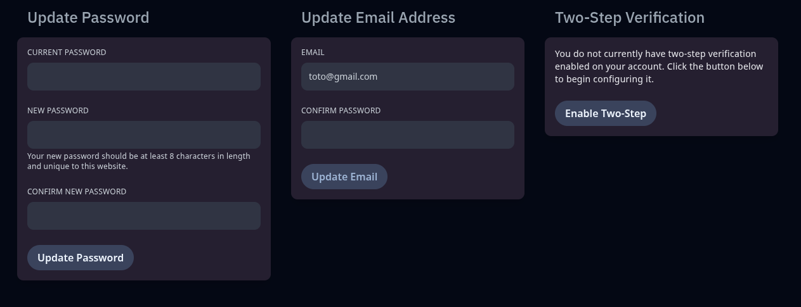

## 👤 Mon compte (Account)

L’onglet **Account** vous permet de gérer les **informations personnelles** liées à votre compte utilisateur sur le panel.
Il centralise les paramètres essentiels pour **la sécurité, l’accès et la récupération** de votre compte.

### 🔒 Modifier son mot de passe

Vous pouvez changer votre mot de passe en renseignant :

* Votre **mot de passe actuel**
* Un **nouveau mot de passe sécurisé**
* Une confirmation du nouveau mot de passe

> 🔐 Le mot de passe doit contenir **au moins 8 caractères** et être unique à ce site.

### 📧 Modifier son adresse e-mail

Pour mettre à jour votre adresse e-mail :

* Saisissez une **nouvelle adresse**
* Confirmez avec votre **mot de passe actuel**

Cela permet de garder votre compte à jour pour la récupération et les notifications.

### 🔐 Authentification à deux facteurs (2FA)

Activez la **vérification en deux étapes** pour renforcer la sécurité de votre compte.
Ce système ajoute une seconde couche de protection via une application d’authentification (comme Google Authenticator, Authy, etc.).

* Cliquez sur **“Enable Two-Step”**
* Scannez le QR code avec votre appli
* Entrez le code généré pour activer la sécurité

> ✅ Fortement recommandé pour tous les utilisateurs ayant des permissions élevées ou un accès à plusieurs serveurs.

---

🔧 **Aperçu de l’onglet Account** :

---