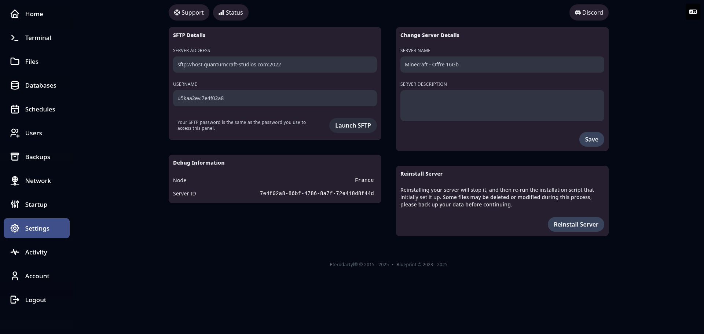

## ⚙️ Paramètres du serveur (Settings)

L’onglet **Settings** regroupe plusieurs outils liés à la **configuration générale**, à l’**accès SFTP**, et à la **gestion technique** de votre serveur.

### 🔐 Informations SFTP

Dans la section **SFTP Details**, vous retrouvez les informations pour vous connecter via un client FTP sécurisé (comme FileZilla ou WinSCP) :

* **Adresse du serveur** (ex: `sftp://host.quantumcraft-studios.com:2022`)
* **Nom d’utilisateur** unique pour votre serveur
* ⚠️ Le **mot de passe est le même que celui de votre compte panel**

> 🎯 Cette méthode est utile pour transférer rapidement des fichiers volumineux ou gérer votre serveur depuis un logiciel externe.

### 📝 Modifier les informations du serveur

Vous pouvez personnaliser :

* Le **nom affiché** de votre serveur dans le panel
* Une **description** libre (visible uniquement dans l’interface)

### ♻️ Réinstaller le serveur

Le bouton **Reinstall Server** permet de réinitialiser votre serveur. Cela va :

* Arrêter le serveur
* Relancer le script d’installation initial
* ⚠️ **Attention :** certaines données peuvent être supprimées. Pensez à **faire une sauvegarde** avant !

### 🛠️ Informations techniques

En bas de page, vous pouvez consulter :

* Le **node** (localisation physique ou logique du serveur)
* Le **Server ID**, utile pour les rapports techniques

---

🧾 **Aperçu de l’onglet Settings** :

---