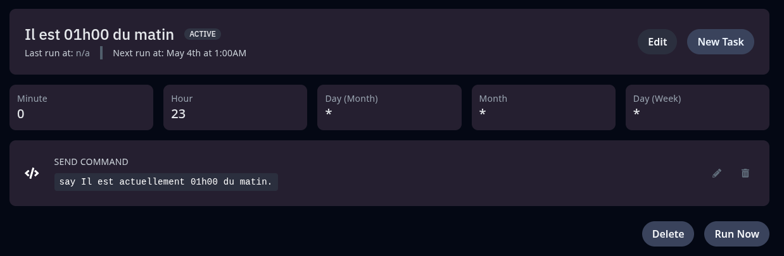
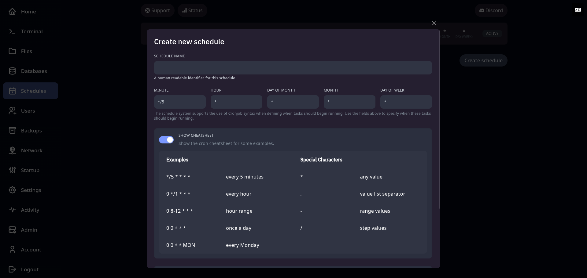

## ⏰ Planification des tâches (Schedules)

Le système de **planification des tâches** vous permet d’automatiser certaines actions sur votre serveur à des moments précis.
Idéal pour les redémarrages réguliers, les sauvegardes automatiques ou l’exécution de commandes serveur.

Depuis l’onglet **Tâches planifiées**, vous pouvez :

* **Créer un planning** avec un nom et une description
* Définir une **fréquence d’exécution** (heures, jours, etc.) à l’aide du système **cron**
* Ajouter une ou plusieurs **actions** à exécuter, comme :

  * Lancer une **commande** (`say Redémarrage dans 1 minute`, etc.)
  * Créer une **backup** automatiquement
  * **Redémarrer**, **arrêter** ou **démarrer** automatiquement le serveur

🔁 Les tâches peuvent être configurées pour s’exécuter **une seule fois** ou se **répéter régulièrement**, selon l’intervalle défini.

---

⚠️ **Fuseau horaire — Attention aux décalages !**

Même si le panel est configuré sur le fuseau horaire **Europe/Paris**, il se peut que les tâches soient exécutées selon l’heure **UTC** (temps universel coordonné).
Dans ce cas :

* Soustrayez **1 heure** en hiver (UTC+1)
* Soustrayez **2 heures** en été (UTC+2)

> ✅ **Exemple** : pour exécuter une tâche à 01h00 du matin (heure de Paris) en été, configurez-la à **23h00** dans le planificateur.

---

🗓️ **Aperçu de la planification d'une tâche** :

---