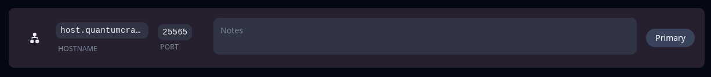

## 🌐 Réseau (Network)

L’onglet **Network** vous permet de **gérer les ports** utilisés par votre serveur, notamment pour les plugins, les services externes ou les connexions personnalisées.

Depuis cette section, vous pouvez :

* **Consulter l’adresse IP principale** et le **port attribué** à votre serveur
* **Définir le port par défaut** utilisé par le serveur au démarrage

🔌 Cette gestion est utile si vous hébergez des services nécessitant des ports spécifiques (ex : Dynmap, RCON, API REST de plugins…).

---

📡 **Aperçu de l’onglet Réseau** :

---

💡 **À savoir** :

* Certains ports peuvent être **restreints** ou **déjà utilisés** par d'autres services sur le node.
* Si vous ne pouvez pas ajouter de ports, contactez le support pour demander un nouveau port.

---