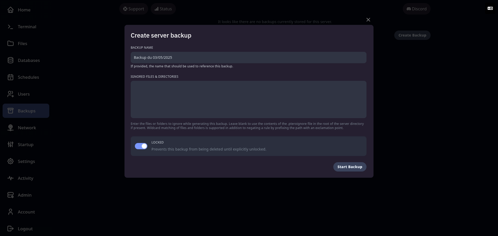
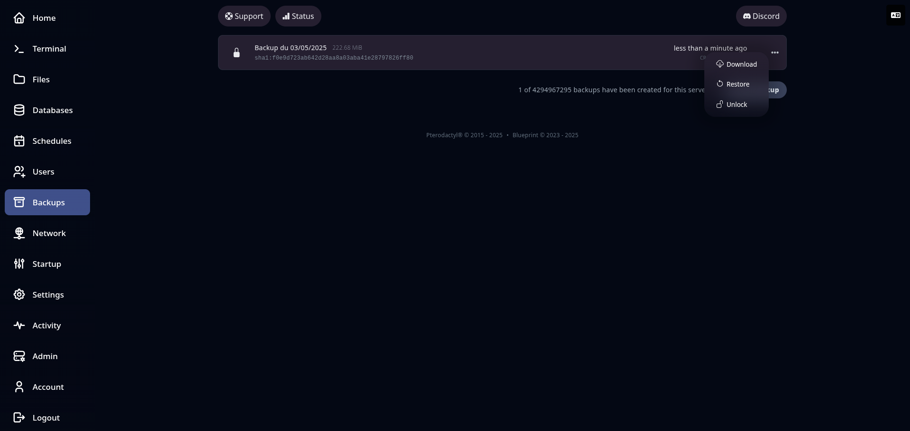

## 💾 Sauvegardes (Backups)

L’onglet **Backups** vous permet de créer et gérer des **sauvegardes automatiques ou manuelles** de votre serveur.
C’est une fonctionnalité essentielle pour protéger vos données en cas d’erreur, de crash ou de mauvaise manipulation.

Depuis cet onglet, vous pouvez :

* **Créer une sauvegarde** complète en un clic
* Choisir si la sauvegarde doit :

  * Inclure tous les fichiers
  * **Exclure certains fichiers/dossiers** (via une liste de chemins à ignorer)
* **Télécharger une sauvegarde** sur votre ordinateur
* **Restaurer** une sauvegarde pour revenir à un état antérieur
* **Supprimer** une sauvegarde obsolète ou inutile

🔄 Les sauvegardes peuvent également être **automatisées** via le système de planification des tâches.

---

🧱 **Aperçu de l’onglet Backups** :

---

---

💡 **Bonnes pratiques** :

* Effectuez une sauvegarde **avant toute modification importante** (installation de plugin, mise à jour, etc.)
* Ne stockez pas trop de sauvegardes simultanément pour ne pas saturer l’espace disque
* Pensez à **automatiser vos sauvegardes régulières** (ex : tous les jours à 4h)

---