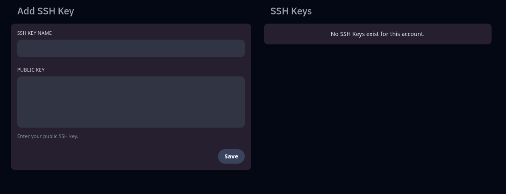

## 🔐 Clés SSH (SSH Keys)

L’onglet **SSH Keys** permet d’ajouter des **clés publiques SSH** à votre compte pour effectuer des connexions sécurisées à l’API ou à d'autres outils compatibles (via des accès automatisés ou développeurs).

Cela vous permet de **vous authentifier sans mot de passe**, avec un haut niveau de sécurité.

### ➕ Ajouter une clé SSH

Pour ajouter une nouvelle clé SSH :

1. Donnez un **nom** à votre clé (ex. `clé-laptop`, `dev-bot`)
2. Collez votre **clé publique** au format OpenSSH (commence généralement par `ssh-rsa` ou `ssh-ed25519`)
3. Cliquez sur **Save**

> 💡 Tu peux générer une paire de clés SSH sur ton poste avec la commande :  
> `ssh-keygen -t ed25519 -C "mon-email@domaine.com"`  
> Exemple : `ssh-keygen -t ed25519 -C "monsuperpseudo@gmail.com"`

### 📋 Gérer vos clés

* Les clés ajoutées apparaîtront dans la liste à droite.
* Vous pouvez **supprimer** une clé à tout moment si elle n’est plus utilisée.

---

⚠️ **Important** :

> Le panel ne permet pas de se connecter directement en SSH sur le serveur.
> Les clés sont principalement utilisées pour **interagir avec certaines API ou automatisations avancées**.

---

🖥️ **Aperçu de l’onglet SSH Keys** :

---